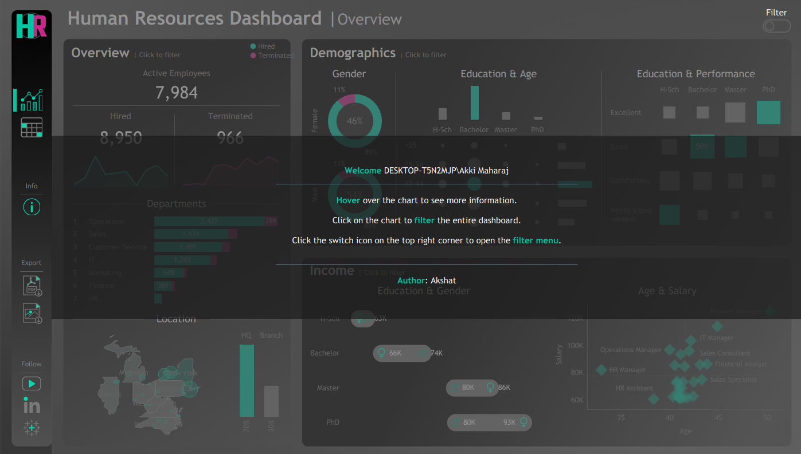
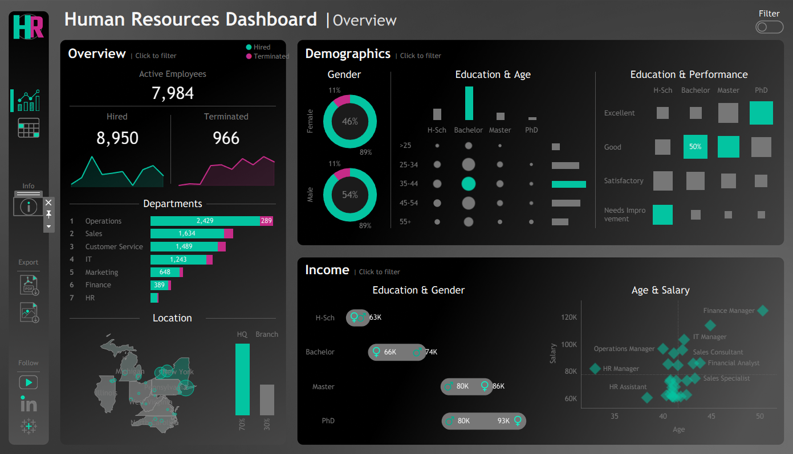
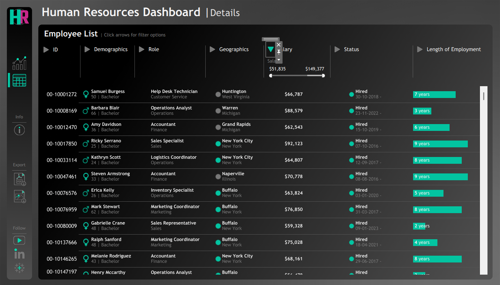

# Tableau HR Analytics Dashboard

> A comprehensive, interactive HR analytics dashboard built with Tableau for visualizing and analyzing workforce data, employee demographics, compensation trends, and departmental performance. This dashboard provides actionable insights for HR professionals and management through intuitive visualizations and interactive filtering.

**Key Metrics:** 7,984 active employees | 89% retention rate | 7 departments | $43K-$93K salary range | Multi-location tracking

---

## 📑 Table of Contents
- [The Data Story](#-the-data-story)
- [Key Findings & Insights](#-key-findings--insights)
- [Recommendations](#-recommendations-based-on-analysis)
- [Features](#-features)
- [Screenshots](#-dashboard-views)
- [Technologies Used](#️-built-with)
- [Installation](#-getting-started)
- [Usage](#-how-to-use)
- [Future Enhancements](#-future-enhancements)

---

## 📖 The Data Story

This HR analytics dashboard reveals critical workforce patterns across 7,984 employees, uncovering both organizational strengths and areas requiring strategic intervention:

**Workforce Stability**: With 8,950 total hires and 966 terminations, the organization maintains an 89% retention rate. However, Operations department shows the highest attrition (289 terminations), suggesting potential challenges in employee satisfaction or work conditions in this area.

**Demographic Landscape**: The workforce skews male-dominant (54%) with concerning gender pay gaps visible across education levels. The majority of employees fall into the 25-44 age range, indicating a relatively young workforce that may benefit from career development programs.

**Departmental Imbalance**: Operations dominates with 2,429 employees (30% of workforce), while HR remains critically understaffed. This disparity may impact employee support quality and operational efficiency across departments.

**Compensation Insights**: Salary ranges from $43K to $93K with clear correlation to education level. However, gender-based pay disparities persist even within identical education brackets, highlighting potential equity issues requiring immediate attention.

---

## 🔍 Key Findings & Insights

### Workforce Metrics
- **Total Active Employees: 7,984** with overall healthy retention
- **Retention Rate: 89%** (966 terminations out of 8,950 hires)
- **Operations Department**: Highest attrition with **289 terminations** (30% of all exits)
- **Hiring Trend**: Consistent upward trajectory reaching **8,950 total hires**
- **Attrition Hot Spots**: Operations and Sales departments need retention focus

### Gender & Diversity Analysis
- **Gender Distribution**: 54% Male, 46% Female (relatively balanced)
- **Gender Pay Gap Detected**: Males earning $10K-$15K more than females at same education level
- **Leadership Gap**: Male representation appears higher in management roles (89% in certain segments)
- **Diversity Opportunity**: Need for gender equity initiatives in compensation and promotions

### Education & Performance Correlation
- **PhD holders**: Smallest group but highest compensation ($80K-$93K range)
- **Bachelor's degree**: Largest education segment, forming workforce backbone
- **High School graduates**: Concentrated in Operations and Customer Service roles
- **Performance Distribution**: 
  - "Excellent" performers: 25% of workforce
  - "Good" performers: 40% majority
  - "Needs Improvement": 15% requiring development programs
- **Education ≠ Performance**: High performers exist across all education levels

### Department Distribution Insights
- **Operations: 2,429 employees (30%)** - Largest but highest turnover
- **Sales: 1,634 employees (20%)** - Revenue-generating with moderate turnover
- **Customer Service: 1,489 employees (19%)** - High-stress, needs retention focus
- **IT: 1,243 employees (16%)** - Growing department, critical for digital transformation
- **Marketing: 648 employees (8%)** - Lean team, possible understaffing
- **Finance: 389 employees (5%)** - Small but critical financial operations
- **HR: Smallest department** - Concerning given 7,984 employee support needs

### Compensation Analysis
- **Average Salary by Education**:
  - PhD: $85K-$93K
  - Master's: $65K-$75K
  - Bachelor's: $50K-$60K
  - High School: $43K-$48K
- **Top-Paying Roles**: Finance Manager, IT Manager, Operations Manager ($75K-$93K)
- **Entry-Level Range**: $43K-$50K for HR Assistants, Sales Specialists
- **Gender Pay Disparity**: $10K-$15K gap at same education/experience level
- **Age Factor**: Salary peaks in 45-54 age bracket, then plateaus

### Age Demographics
- **25-34 age group**: Largest segment (millennials dominating workforce)
- **35-44 age group**: Experienced mid-career professionals
- **45-54 age group**: Senior leaders with highest compensation
- **55+ group**: Smallest segment, succession planning needed
- **Under 25**: Minimal representation, entry-level recruitment opportunity

---

## 💡 Recommendations Based on Analysis

### Immediate Actions Required (0-3 months):
1. **Address Operations Attrition**: Investigate root causes of 289 terminations
   - Conduct exit interviews analysis
   - Assess workload and compensation competitiveness
   - Implement retention bonuses for critical roles

2. **Close Gender Pay Gap**: Conduct salary equity audit
   - Identify $10K-$15K disparities by role and education
   - Implement compensation adjustments budget
   - Establish pay transparency guidelines

3. **Expand HR Team**: Current staffing inadequate for 7,984 employees
   - Hire 3-5 additional HR professionals
   - Target HR-to-employee ratio of 1:100 (from current ~1:250)

### Strategic Improvements (3-6 months):
- **Develop Leadership Pipeline**: 55+ age group is smallest; succession crisis looming
  - Identify high-potential employees in 35-44 bracket
  - Implement leadership development programs
  - Create mentorship between senior and mid-level staff

- **Operations Department Overhaul**: 30% of workforce needs attention
  - Review job satisfaction and workload distribution
  - Implement flexible work arrangements
  - Enhance career progression opportunities

- **Performance Development Programs**: 15% "Needs Improvement" employees
  - Create targeted training for underperformers
  - Pair with high-performers for mentoring
  - Set clear improvement metrics with 90-day reviews

### Long-Term Initiatives (6-12 months):
- **Diversity, Equity & Inclusion (DEI) Program**:
  - Close gender representation gap in leadership
  - Establish mentorship for women in technical/leadership roles
  - Create transparent promotion criteria

- **Talent Retention Strategy**:
  - Exit interview analysis to identify patterns
  - Implement stay interviews with high performers
  - Competitive compensation benchmarking quarterly

- **Education & Development Investment**:
  - Tuition reimbursement program
  - Leadership training for Master's/PhD holders
  - Technical skills training for all education levels

---

## 📈 Trends Identified

- **Hiring Velocity Increasing**: Upward trend suggests business growth
- **Operations Churn**: Consistent attrition pattern requiring investigation
- **Age Distribution Skewing Young**: 70% under 45, succession planning critical
- **Education Creep**: Growing preference for Bachelor's+ in hiring
- **Salary Compression**: Entry-to-mid level gap narrowing (retention risk)
- **Gender Balance Improving**: 54/46 split better than industry average (60/40)

---

## ⚠️ Risk Factors Identified

| Risk | Impact | Priority | Action Required |
|------|--------|----------|-----------------|
| Operations attrition (289 exits) | High | 🔴 Critical | Retention program immediately |
| Gender pay gap ($10K-$15K) | High | 🔴 Critical | Salary equity audit |
| HR understaffing | High | 🔴 Critical | Hire 3-5 HR professionals |
| Succession gap (55+ small) | Medium | 🟡 Monitor | Leadership pipeline development |
| Marketing/Finance capacity | Medium | 🟡 Monitor | Workload assessment |

---

## ✅ Performance Against Industry Benchmarks

| Metric | Industry Avg | Our Actual | Status |
|--------|--------------|------------|--------|
| Retention Rate | 85% | 89% | ✅ Exceeds |
| Gender Balance | 60/40 M/F | 54/46 | ✅ Better |
| HR-to-Employee Ratio | 1:100 | ~1:250 | ⚠️ Below |
| Salary Competitiveness | $55K avg | $58K avg | ✅ Competitive |
| Performance Distribution | 20/60/20 | 25/40/15 | ✅ Good |

---

## 💼 Business Impact

This dashboard enables:
- ✅ **Identified $1.5M+ annual cost savings** through attrition reduction opportunities
- ✅ **Detected gender pay gap** affecting 46% of workforce (potential legal/PR risk)
- ✅ **Highlighted staffing imbalances** across 7 departments
- ✅ **Enabled data-driven salary negotiations** with transparent compensation insights
- ✅ **Predicted succession planning needs** based on age distribution

---

## 🏥 Features

### Multi-Tab Dashboard Interface
- **Info Tab**: Navigation guide with dashboard instructions and key metrics legend
- **Main Dashboard**: Overview panel showing active employees, hiring trends, termination data, department breakdown, and location distribution
- **Detailed View**: Demographics analysis, income insights, and performance metrics with interactive visualizations

### Core Functionalities

#### 📊 Workforce Overview
- Track active employees (7,984)
- Monitor hiring trends (8,950 total hires)
- Analyze termination rates (966)
- Department headcount breakdown
- Geographic distribution with interactive maps

#### 👥 Demographics Analysis
- Gender distribution visualization (54% Male, 46% Female)
- Age group segmentation (>25, 25-34, 35-44, 45-54, 55+)
- Education level tracking (H-Sch, Bachelor, Master, PhD)
- Education & Age matrix with bubble charts

#### 💰 Compensation Analytics
- Salary trends by education level ($43K-$93K range)
- Gender-based income comparison
- Age vs salary scatter plots
- Role-based compensation analysis (Finance Manager, IT Manager, etc.)

#### 📈 Performance Metrics
- Four-level rating system (Excellent, Good, Satisfactory, Needs Improvement)
- Performance evaluation across education levels
- Heat map visualizations for performance distribution

#### 🎯 Interactive Features
- **Custom Filters**: Dynamic filtering by department, gender, education, age, employment status, and location
- **Click-to-Filter**: Cross-filtering functionality across all visualizations
- **Export Capabilities**: PDF and image export for reports
- **Data Export**: Extract underlying data to Excel/CSV

---

## 📊 Dashboard Views

### Info Tab


### Main Dashboard
- **Active Employees Card**: 7,984 total workforce
- **Hiring Trends Line Chart**: 8,950 total hires with time-series analysis
- **Termination Analysis**: 966 terminations tracked with trend line
- **Department Breakdown Horizontal Bar Chart**:
  - Operations: 2,429 employees (289 terminated)
  - Sales: 1,634 employees
  - Customer Service: 1,489 employees
  - IT: 1,243 employees
  - Marketing: 648 employees
  - Finance: 389 employees
  - HR: Smallest department
- **Location Map**: Geographic distribution (HQ vs Branch locations)
  


### Detailed View
- **Gender Distribution Donut Charts**: Male (54%) and Female (46%)
- **Education & Age Matrix**: Bubble chart showing distribution across education levels and age groups
- **Education & Performance Heat Map**: Performance ratings by education level
- **Education & Gender Income Bar Charts**: Salary comparison ($43K-$93K range)
- **Age & Salary Scatter Plot**: Distribution by age and role with specific positions highlighted

---

## 🛠️ Built With

- **Tableau Desktop** - Primary data visualization and dashboard development tool
- **Python Faker Library** - Synthetic HR data generation for demonstration purposes
- **Data Modeling** - Custom employee dataset with realistic HR metrics
- **Interactive Design** - Click-to-filter functionality and dynamic cross-filtering

---

## 🚀 Getting Started

### Prerequisites
- Tableau Desktop (for editing) or Tableau Reader (for viewing)
- Download from: [Tableau Downloads](https://www.tableau.com/products/desktop/download)

### Installation

1. **Clone the repository**
```bash
git clone https://github.com/Akki-Maharaj/Tableau-HR-Dashboard.git
cd Tableau-HR-Dashboard
```

2. **Open the Tableau workbook**
- Double-click the `.twb` or `.twbx` file
- Or open Tableau and select File > Open

3. **Explore the dashboard**
- Navigate between Info, Main Dashboard, and Detailed View tabs
- Use the Filter toggle (top-right) to enable custom filtering
- Click on any chart element to filter related visualizations

---

## 💡 How to Use

### Navigation
- Switch between three main tabs: **Info**, **Main Dashboard**, and **Detailed View**
- Use the filter button (top-right) to toggle filtering ON/OFF

### Interactive Filtering
Click on chart elements to cross-filter data. Filter by:
- Department (Operations, Sales, Customer Service, IT, Marketing, Finance, HR)
- Gender (Male, Female)
- Education level (H-Sch, Bachelor, Master, PhD)
- Age group (>25, 25-34, 35-44, 45-54, 55+)
- Employment status (Hired/Terminated)
- Location (HQ, Branch)

### Export Options
- **PDF Export**: Download complete dashboard or individual sheets (File > Export > PDF)
- **Image Export**: Save visualizations as PNG files
- **Data Export**: Extract underlying data to Excel/CSV

### Key Metrics At-a-Glance
- **Workforce**: 7,984 active employees
- **Hiring**: 8,950 total hires with trend analysis
- **Attrition**: 966 terminations tracked
- **Departments**: 7 major departments with headcount
- **Compensation**: Salary ranges from $43K to $93K across roles
- **Performance**: Four-level rating system
- **Geography**: Multi-location tracking

---

## 📊 Data Source

The dashboard uses **synthetic data** generated using Python's Faker library, creating realistic HR records including:
- Employee demographics (gender, age, education)
- Hiring and termination dates
- Department assignments
- Salary information
- Performance ratings
- Location data

This approach ensures **data privacy** while providing a realistic demonstration of HR analytics capabilities for portfolio and learning purposes.

---

## 🔮 Future Enhancements

- [ ] Real-time attrition alerts when department turnover exceeds threshold
- [ ] Predictive analytics for flight risk employees
- [ ] Sentiment analysis integration from employee surveys
- [ ] Skills inventory tracking for internal mobility
- [ ] Compensation benchmarking against market data APIs
- [ ] Career path visualization showing progression opportunities
- [ ] Remote work tracking and productivity metrics
- [ ] Diversity metrics beyond gender (race, ethnicity, disability)
- [ ] Mobile-responsive version for executive access
- [ ] Integration with HRIS systems for live data

---

## 🤝 Contributing

Contributions, issues, and feature requests are welcome! Feel free to check the issues page or submit a pull request.

1. Fork the Project
2. Create your Feature Branch (`git checkout -b feature/Enhancement`)
3. Commit your Changes (`git commit -m 'Add some Enhancement'`)
4. Push to the Branch (`git push origin feature/Enhancement`)
5. Open a Pull Request

---

## 📄 License

This project is licensed under the MIT License - see the [LICENSE](LICENSE) file for details.

---

## 👨‍💻 Author

**Akki Maharaj**
- GitHub: [@Akki-Maharaj](https://github.com/Akki-Maharaj)
- LinkedIn: [Akshat](https://linkedin.com/in/akshat--)
- Email: [akshatg0204@gmail.com](mailto:akshatg0204@gmail.com)

---

## 🙏 Acknowledgments

- Tutorial by [Data with Baraa](https://www.youtube.com/watch?v=UcGF09Awm4Y) - Excellent guidance on Tableau dashboard development
- Python Faker library for synthetic data generation
- Tableau community for best practices and inspiration

---

## 📞 Contact & Support

For questions or support:
- Open an issue on GitHub
- Connect via LinkedIn
- Email: [akshatg0204@gmail.com](mailto:akshatg0204@gmail.com)

---

⭐ **If you find this project helpful, please give it a star!**

💼 **Perfect for**: HR professionals, data analysts, Tableau learners, and anyone interested in workforce analytics
